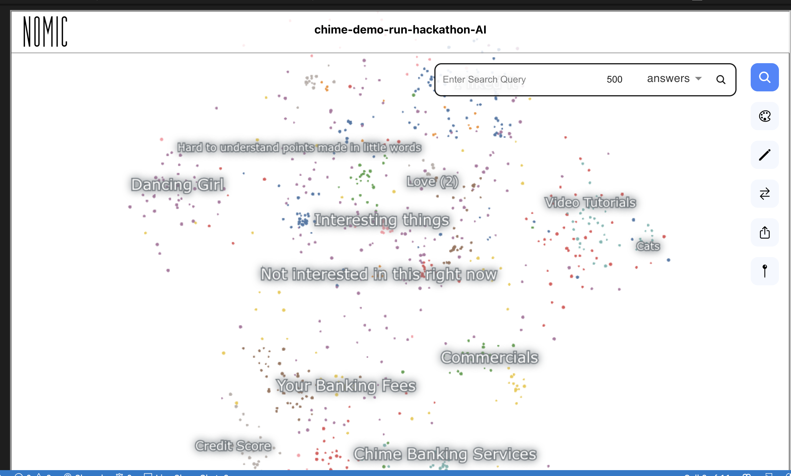

# SwayableAtlasAnalysis
Uses Atlas Vector Embeddings Display and Search for Swayable Customer Analysis
- Vectorizes user surveys using over 30 different segments
- Uses K-Nearest Neighbors to find similar users
- Synthesizes insights using OpenAI GTP4

## See the project at <a href="https://github.com/YanniKouloumbis/SwayableAtlasAnalysis/blob/master/analysis.ipynb">Analysis.ipynb</a>

